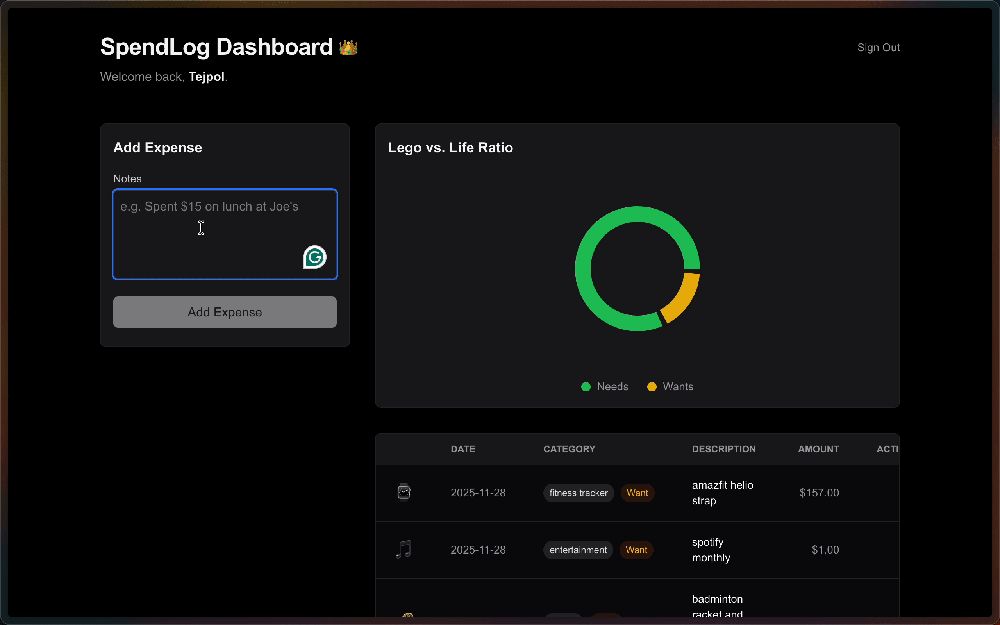

# WalletRIP 💸


> **Stop lying to yourself about where the money went.**

## 🔗 Live Demo
[walletRIP.vercel.app](https://walletrip.vercel.app)



## 🧐 The Vibe
Most expense trackers are boring spreadsheets that feel like homework. **WalletRIP** is your wallet's conscience. It doesn't just track your spending; it judges it.

It’s built for speed, privacy, and brutal honesty.

## ✨ Key Features

### 🧠 The AI Brain
Forget forms. Just type naturally: *"Spent 50 on pizza"* or *"Uber to work 25"*. The integrated AI parses the context, categorizes it, and logs it instantly. No local processing—everything happens in the cloud for maximum efficiency.

### ⚖️ The Sarcastic Judge
If you spend money on "Needs" (Rent, Groceries), it stays quiet. If you blow cash on "Wants" (Lego, overpriced coffee), it delivers a sarcastic reality check. It keeps you humble.

### 🔧 Under the Hood: The Engineering
We don't just ask Gemini to "read this." We feed it a strict system prompt that enforces:
1.  **JSON Schema Validation**: Ensures data is always clean for the database (no more "misc" categories).
2.  **Context Injection**: The AI is told it's a "Sarcastic Canadian Accountant." It knows 50 CAD is a normal lunch but 500 CAD is a crime.
3.  **Creative Temperature**: We dial up the creativity for the `funny_comment` field while keeping the `amount` and `date` fields strictly deterministic.

### 👻 Ghost Protocol Auth
Privacy is paramount.
- **No Email Required**: We don't want your spam address.
- **No Phone Numbers**: We don't want to text you.
- **Callsign Access**: Just pick a unique **Callsign** (username) and a **Secret Code**.
- **Universal Sync**: Access your data securely from any device—Mobile, Tablet, or Desktop.

### 🛡️ Military-Grade Security
Built on **Supabase** with strict **Row Level Security (RLS)**. Your financial data is isolated, encrypted, and visible *only* to you.

### 🎯 Zero-Hallucination Mode
The AI is trained to *never guess prices*. If you say "I want a PS5", it won't log $500 automatically; it asks you for the price.

### � Install on Mobile (PWA)
WalletRIP works best as a native app on your phone.
- **iOS (iPhone)**: Open Safari -> Tap Share -> Tap "Add to Home Screen".
- **Android**: Open Chrome -> Tap Menu (3 dots) -> Tap "Install App".


## �👥 How to Join
This is a private instance (I'm broke and can't pay for everyone's API usage), but you can join if you have an invite code.

1. **Go to [walletRIP.vercel.app](https://walletrip.vercel.app)**
2. **Click "Sign Up"**
3. **Choose a Callsign**: This is your unique username. Be creative.
4. **Set a Secret Code**: Must be at least 6 characters. Don't forget it; there is no "Forgot Password" link.
5. **Enter Invite Code**: You need a key to enter.

**Need a key? Slide into my DMs:**
- 💼 **LinkedIn**: [Tejal Goyal](https://www.linkedin.com/in/tejalgoyal)
- 📸 **Instagram**: [@teejpol](https://www.instagram.com/teejpol)

*(I try to reply ASAP, but no guarantees. I have a life... mostly.)*

*Want to run your own instance? Follow the setup guide below.*

## 🛠️ The Stack
- **Framework**: Next.js 15 (App Router)
- **Database**: Supabase (PostgreSQL)
- **Styling**: Tailwind CSS + Framer Motion
- **Intelligence**: Google Gemini 1.5 Flash

## 🚀 Getting Started (Self-Host)

### 1. Clone & Install
```bash
git clone https://github.com/tejalgoyal2/WalletRIP.git
cd spendlog
npm install
```

### 2. Environment Setup
Create a `.env.local` file:
```env
GEMINI_API_KEY=...
NEXT_PUBLIC_SUPABASE_URL=...
NEXT_PUBLIC_SUPABASE_ANON_KEY=...
```

### 3. Run Locally
```bash
npm run dev
```

---
Built with 🖤 and absolute chaos by **Tejal**.
